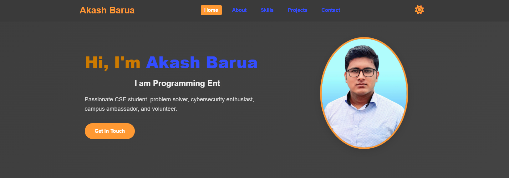

# Akash Barua Portfolio Website

This is my personal portfolio website showcasing my skills, projects, and contact information.

## Features

- Responsive layout with sections: Home, About, Skills, Projects, Contact
- Dark Mode toggle functionality using JavaScript
- Screenshots included for all main sections, displayed below
- Simple and clean design with CSS styling

## Folder Structure
akash-portfolio/
├── assets/ # Screenshots images (ss1.png, ss2.png, ..., ss6.png)
├── index.html # Main HTML page
├── style.css # CSS styling
├── script.js # JavaScript for Dark Mode
└── README.md # This file

## Screenshots Preview

| Home                     | About                    | Skills                   |
|--------------------------|--------------------------|--------------------------|
|   |  |  |

| Projects                 | Contact                  | Dark Mode                |
|--------------------------|--------------------------|--------------------------|
|  |  |  |

## How to View Locally

1. Clone the repository or download the ZIP.
2. Open `index.html` in your browser.

## Live Demo

[https://akashbarua969.github.io/akash-portfolio/](https://akashbarua969.github.io/akash-portfolio/)

## Contact

You can contact me at: **akashbarua969@gmail.com**

---

Created by Akash Barua
